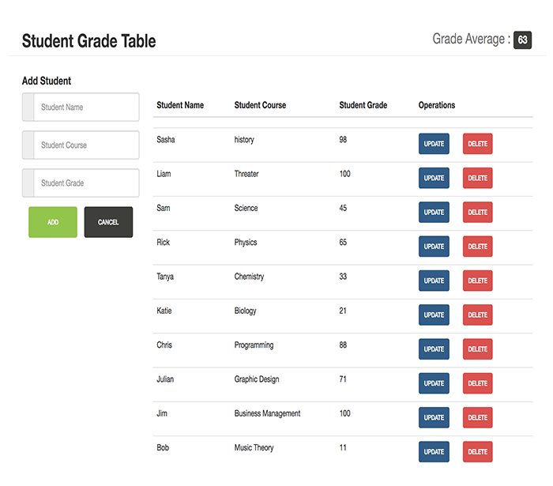

# Student Grade Table

A content management system that allows users to add, update, and delete student data from the Firebase database and see the cumulative grade average.

#### Features

- Ability to add new students to the table and have the grade average update on submit
- Live deletion of student from database and update of cumulative grade average
- Error handling for student name, grade, and course
- Clear button to reset form and error messages

### Technology Used

- JavaScript
- JQuery
- ES5
- Firebase
- HTML5
- CSS3
- Bootstrap

### Tools Used

- Git
- Github
